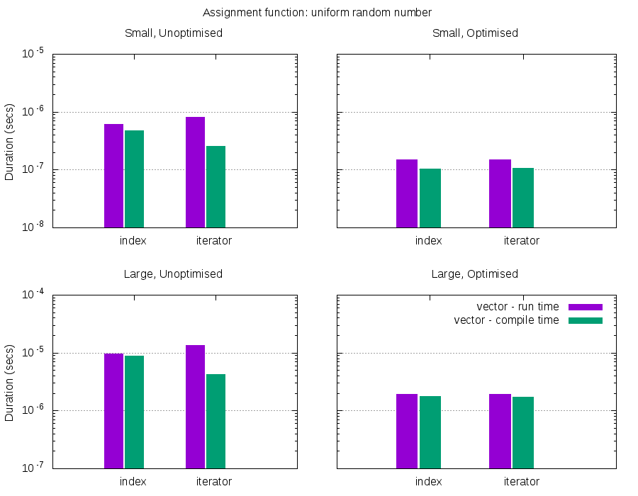
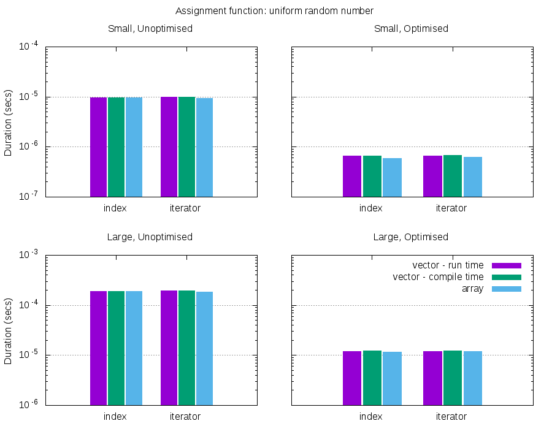

Comparison of using `std::vector` and `std::array` in C++
------

The project I'm about to start will require using one of these containers to store a numerical grid for PDE solving. I wanted to have a *reason* to use either, so did a simple numerical experiment to get a **zeroth order answer**. The test has only been performed on the GNU g++5.2.1 compiler on a laptop which runs an Intel Core i5-4258U CPU @ 2.40GHz. The experiment tests only serial, not parallel code.

There are three ways of using these containers: `std::vector` with the size specified at compile time **and** run time, and `std::array` which only takes size at compile time.

### Tests

There are a few different considerations for how each container can be used:
* large or small number of elements? 50 or 1000 elements
* access via an `index` or `iterator`
* optimisation using compiler flags, in this case `-O3`

A test was measured as follow:
* start a timer
* initialise the container to the correct size
* loop through the container filling each element using a function
* stop the timer, add this duration to the average
* repeat for the desired average

This approximately reflects the way which the container will be implemented in future code, initialised using a function. Initialiser-list would be faster, but don't reflect how the container will actually be used.

A test was a combination of the options listed above for each container.

### Results

The histograms below outlines the results for this experiment:

As can be seen from the right two graph in the figure, once the optimisation flag is turned on there is very little difference between all the containers or method of access. In the un-optimised case using a `std::array` with `iterators` outperforms all other options in the two regimes of large and small element number.

The next function tested was the `std::default_random_engine` using a `std::uniform_real_distribution<double>`.

However there is even less to distinguish between the different cases here, most likely because the random engine take a long time to process so smears out any differences between containers or access.

### Conclusion

There appear to be very few differences in speed between the difference containers, when optimisation is turned on. Possibly another important check will be read speeds, which might help decided the best candidate for this job.

The only (trivial) conclusion to be made is to turn on optimisation when speed is necessary

